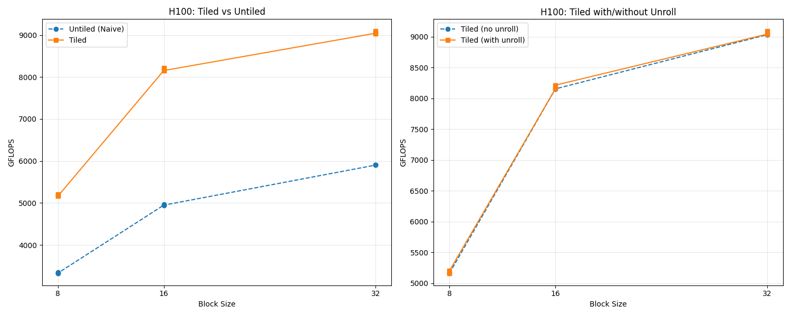
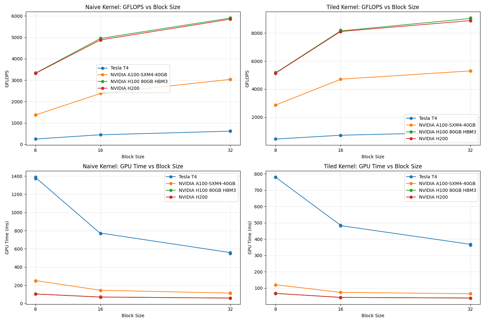
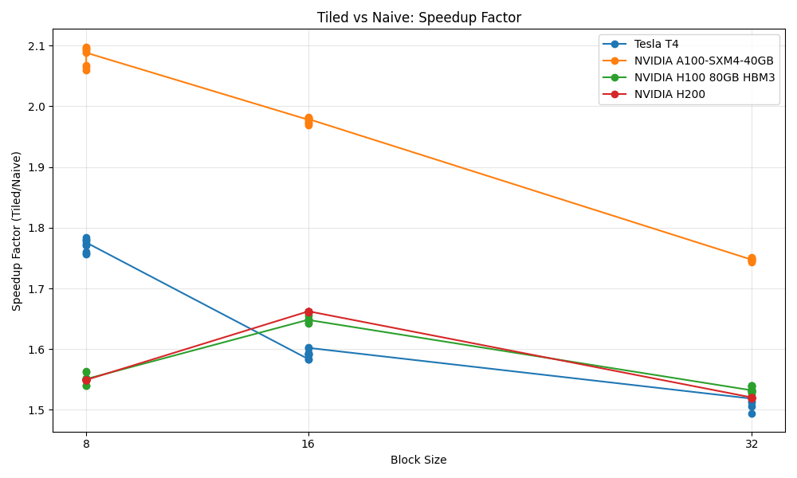

# What did I do?

Implement matrix multiplication with shared memory memory tiles. All experiements are run on NVIDIA GPUs.

### Results


These are the results on an H100 between the naive and the tiled algorithm for different block sizes. NOTE: block sizes are squared so 16 means 16x16 for example.

Where the naive reaches almost 6 TFLOPS while tiled reaches 9 TFLOPS.
Only reaching around 10% of the peak f32 performance (67 TFLOPS) (If using tensor-cores it's another story).

The right side shows that the unroll has no effect. This is expected looking at the ptx code since the compiler is able to unroll the loop automatically.



Here we see the two algorithms run on different GPUs. 


The A100 saw the biggest relative speedup going from naive to tiled.


## How to run
#### Preferred (tested)

Sign up to Modal Labs and run with `uv modal run run_on_modal.py`.

Is that it? Yes, one command to develop and debug on arbitrary NVIDIA hardware (A100, H100, H200, B200) for a few dollars per month.

#### Locally
If you have access to a nvidia gpu:
Compile and run locally
Set `GPU_SM_ARCH` based on your GPU, e.g., for a H200 is use `GPU_SM_ARCH=90`
Compile in debug mode without optimizations:
```bash
mkdir bin && nvcc \
    -arch=compute_${GPU_SM_ARCH} \
    -code=sm_${GPU_SM_ARCH},compute_${GPU_SM_ARCH} \
    -g \
    -O0 \
    -Xcompiler -Og \
    -lineinfo \
    -v \
    -o bin/matmul_binary \
    cuda/matmul_host.cu \
    -lcuda \
    && ./bin/matmul_binary
```